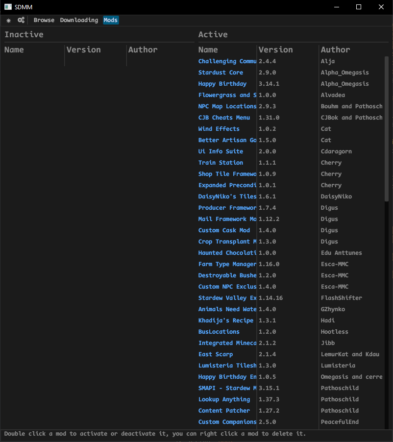

# Stardew Mod Manager

## A simple and sweet mod manager for stardew valley, even my mum can use it

# Installation
Download the executable and place it where you want to have it.
<h4>(<strong>WARNING FOR WINDOWS</strong>)<h4>
Upon opening the application it registers it's current location for the `nxm:` protocol in regedit. 
There is a way to update that location in the settings.

# Usage
<strong>This does not currently support managing mods in other ways aside from the Nexus `Mod Manager Download` Button, but it will be available soon</strong> 
Stardew Mod Manager registers with the `nxm:` protocol from NexusMods meaning that you can install a mod easily by pressing the `Mod Manager Download` button. 
This also extends to SMAPI, it is capable of automatically installing and uninstalling it. 

You can enable and disable mods at will by double clicking on them in the list or right clicking them. 
Mods can also be deleted from the right click context menu.
